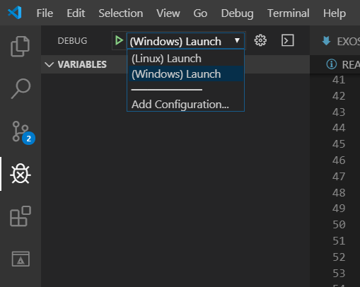

# Code Optimization

Examples and tutorials for code performance improvements for CPU in C++. For GPGPU check [learn-cuda repository](https://github.com/creative-uber-learning/learn-cuda).

## 🚩 Table of Contents

<details><summary>🧩 Show Classes</summary>
<p>

*(🏗️ : Not started | 📝 : Started | 📑 : Needs proofreading | ✔️ : Written )*

* Multi-threading with OpenMP
  * [TP1 ✔️](src/tp-1/README.md)

</p>
</details>

## 👩‍💻 Getting Started

### Cloning with submodules

Open a command line and run :

```
git clone --recurse-submodules -j8 https://github.com/learn-computer-graphics/code-optimization.git
```

### Prerequisites

You can read the classes listed in the table of contents, but if you want to follow along, you need to install [CMake](https://cmake.org/) to build the project, and a C++ compiler which handles C++17.

#### Linux

```bash
sudo apt-get install build-essential cmake
```

#### Windows

To get the MSVC compiler, you need to install [Visual Studio](https://visualstudio.microsoft.com/) (and not VSCode), and select C++ development during installation.

### Build on desktop

You can handle the `CMakeLists.txt` in any way you like, here's some way to use it :

#### `Option 1: CLI`

Go to the folder of this project and run :

```bash
mkdir build
cd build
cmake ..
make
```

#### `Option 2: Visual Studio (Windows only)`

Open this folder with the `CMake...` option in file->open on Visual Studio, and run the project.

<p align="center">
  
</p>

#### `Option 3: VSCode`

Use the `CMakeTools` plugin, build with `f7` then run with `f5` (But be careful to be on the right platform, there is a launch file for windows and for linux).

<p align="center">
  
</p>

## 🕵️‍♂️ Profiling

You can use the [Tracy profiler](https://github.com/wolfpld/tracy/releases/tag/v0.7.6) to check the performance of the code. Simply download and run its executable. When opened, click on connect. 

<p align="center">
  
</p>

Then if you run an executable from this project **in admin**, Tracy will be able to provide dissassembly information.

<p align="center">
  
</p>

## 👨‍👩‍👦‍👦 Contributing

If you find errors in the code, or better way to explain or do things, feel free to open an issue !

## 📖 Sources

### Tools

| Name                                                         | Description                                                  |
| ------------------------------------------------------------ | ------------------------------------------------------------ |
| [Intel VTune](https://software.intel.com/content/www/us/en/develop/tools/vtune-profiler.html) | CPU profiling with low-level information. Comes with [tutorials](https://software.intel.com/content/www/us/en/develop/documentation/vtune-help/top/introduction/tutorials-and-samples.html). |
| [Visual Studio](https://visualstudio.microsoft.com/vs/)      | IDE with good [profiling support](https://docs.microsoft.com/en-us/visualstudio/profiling/?view=vs-2019). Also allows to check threads loads with an [extension](https://docs.microsoft.com/en-us/visualstudio/profiling/threads-view-parallel-performance?view=vs-2019). |
| [Optix](https://github.com/bombomby/optick)                  | CPU & GPU profiler                                           |
| [Chrome Tracing](https://www.chromium.org/developers/how-tos/trace-event-profiling-tool) | Profiler data viewer                                         |
| [NVidia Nsight](https://developer.nvidia.com/nsight-graphics) | Frame Debugger & GPU profiler                                |
| [RenderDoc](https://renderdoc.org/)                          | Frame Debugger with some GPU profiling data                  |
| [Intel GPA](https://software.intel.com/content/www/us/en/develop/tools/graphics-performance-analyzers.html) | Frame Debugger & GPU profiler                                |

### Books

| Name                                                         | Description                                                  |
| ------------------------------------------------------------ | ------------------------------------------------------------ |
| [C++ High Performance](https://www.oreilly.com/library/view/c-high-performance/9781787120952/) | Comes with a [repository](https://github.com/PacktPublishing/Cpp-High-Performance) of examples |

### White Papers

| Name                                                         | Description                                                  |
| ------------------------------------------------------------ | ------------------------------------------------------------ |
| [Software Optimisation Resources](https://www.agner.org/optimize/) | A serie of in-deepth document by Agner Fog on low level CPU architectures and ways to optimise data usage for them. |

### Videos

| Name                                                         | Description                                                  |
| ------------------------------------------------------------ | ------------------------------------------------------------ |
| [What's a creel - Modern x64 assembly](https://www.youtube.com/watch?v=rxsBghsrvpI) | A serie of video on Assembly Language. His channel has also a lot of ressources related to CPU performance. |

### Blogs

| Name                                                         | Description                                                  |
| ------------------------------------------------------------ | ------------------------------------------------------------ |
| [Fabian Giesen (ryg) website](https://fgiesen.wordpress.com/2014/07/07/cache-coherency/) | A great blog from a great engineer talking about CPU and GPU architectures |
| [Blog at the bottom of the sea](https://blog.demofox.org/)   | Alan Wolfe's graphic programming blogs with many articles on performance side |
| [IT Hare](http://ithare.com/)                                | Various and always high-quality articles for programmers     |
| [Simon Schreibt](https://simonschreibt.de/)                  | Various articles on graphics programming performance tricks for various effects in AAA games |
| [Joel on software](https://www.joelonsoftware.com/)          | Various articles with many on performance and best practices by StackOverflow founder |

### Articles

| Name                                                         | Description                              |
| ------------------------------------------------------------ | ---------------------------------------- |
| [Profiling processor cache misses](https://mahdytech.com/vtune-cache-miss/) | An article Ahmed Mahdy about intel VTune |

### Slides

| Name                                                         | Description                                                |
| ------------------------------------------------------------ | ---------------------------------------------------------- |
| [Pitfall Of OOP - Revisited](https://docs.google.com/presentation/d/1ST3mZgxmxqlpCFkdDhtgw116MQdCr2Fax2yjd8Az6zM/edit#slide=id.g23b7dd9698_0_5) | A conference for TGC 2017 by Tony Albrecht on performances |

### Other

| Name                                                      | Description                                               |
| --------------------------------------------------------- | --------------------------------------------------------- |
| [AwesomePerfCpp](https://github.com/fenbf/AwesomePerfCpp) | A compilation of greats links on performance optimisation |
