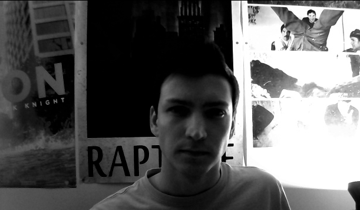
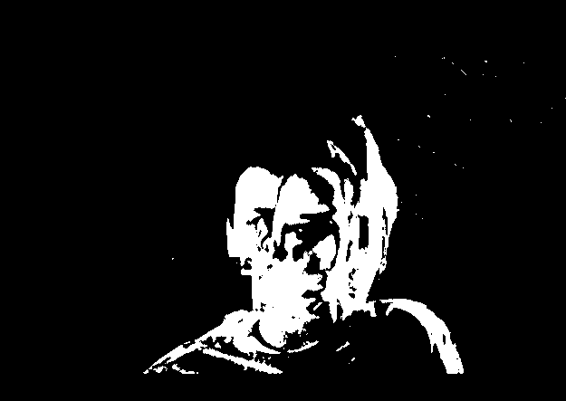
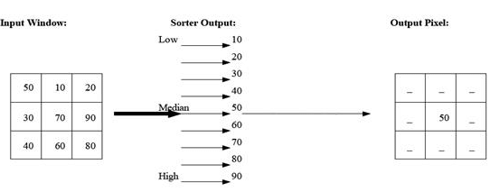
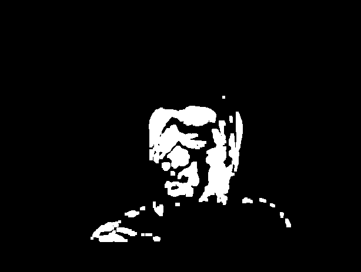
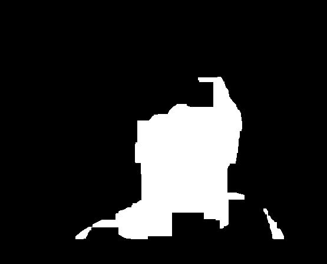
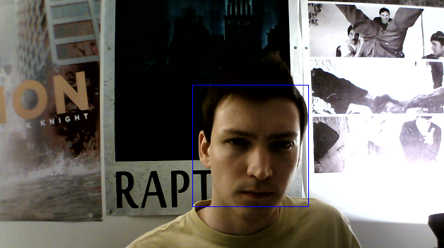
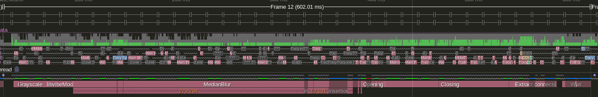
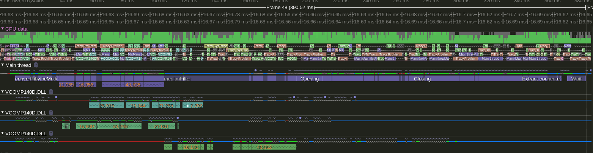
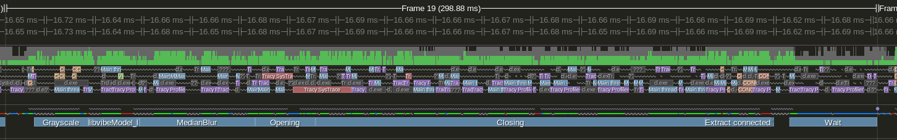

# Parallel Programming - TP2

**Guillaume Haerinck - M2 Image 2021**

**Class by Eva Dokladalova**

## Introduction

The goal of this project is to implement a fast **crowd counting** application using a webcam video stream. The approach is not using the latest state of the art techniques such as machine learning for simplicity purposes. The image acquisition and presentation is done with last version of OpenCV, while the algorithm for crowd counting is custom and / or adapted from other algorithms :

- Each frame is converted to grayscale
- Background subtraction from the video is done with the [ViBe algorithm](http://www.telecom.ulg.ac.be/research/vibe/)
- Median filtering to ease the next steps
- Morphological opening to remove noise
- Morphological closing to fill the gaps
- Connected components extraction and counting

The code has been primarily tested on an Intel Core i3-4160 CPU @3.60GHz with 2 cores and 4 threads.  It supports SIMD through SSE4.2 and AVX2 instructions. Source code for the application can be found [here](https://github.com/learn-computer-graphics/code-optimization/tree/master/src/tp-2).

## Profiling setup

To measure the execution time of each method we rely on the open-source [Tracy](https://github.com/wolfpld/tracy) instrumenting profiler. It will track the execution with the help of the `ZoneScoped` macro placed on top of each important methods. To use it, one simply has to grab the [executable here](https://github.com/wolfpld/tracy/releases/tag/v0.7.7) and run it along with the project. More detailed step about the setup can be found [here](https://github.com/learn-computer-graphics/code-optimization#%EF%B8%8F%EF%B8%8F-profiling).

My choice is motivated by the fact that it is a modern, portative and non-intrusive environment. It offers advanced features such as machine-code view, threads handling and several histograms. Other approaches such as inline `gettimeofday` would have unnecessarily complexified the code while being too thin in details.

## Version 1 - No optimisation

### Implementation



#### Grayscale conversion

We start by converting the 3 channel frame to a 1 channel grayscale to improve the performance of the background detection. We use the following formula for each pixel : `Grayscale = 0.299R + 0.587G + 0.114B`. It is possible to access OpenCV matrices as contiguous array, better suited for cache coherency. In code it is expressed as follows :

```
for (int i = 0; i < in.rows; i++)
    for (int j = 0; j < in.cols; j++)
        out.data[i * out.step + j] = 0.114 * in.data[i * in.step + j * 3] + 0.587 * in.data[i * in.step + j * 3 + 1] + 0.299 * in.data[i * in.step + j * 3 + 2];
```



#### Background subtraction

The background subtraction is the burden of the [ViBe algorithm](http://www.telecom.ulg.ac.be/research/vibe/) and will be better explained in [their research paper](https://orbi.uliege.be/bitstream/2268/145853/1/Barnich2011ViBe.pdf). I used their C source code as the C++ version was contained in multiple files and relied on structures that weakened the understanding of the algorithm. I have made no modification in their source code for this first version. It is available in the `vibe-background-sequential.cpp` file.

#### Median filtering



The median filter will replace each pixel with the median value of its 8 block neighbour. In code it is defined with an array of size 8 that will be filled by the surrounding pixels. Once filled the array is sorted and we take in the center value. In our case, the sort method is an "insertion" sort. For the previous project in tried to use a bubble sort optimisation but it turned out to be less performant than the insertion sort.



#### Opening

The morphological opening is used to remove the noise. I use a small 5x5 kernel of ones. I tried to implement it myself from a portion of code found online but it gave me unsatisfying results for a generous amount of time so I rely on openCV instead. The code is commented so it is still possible to test it easily. The implementation can be found in the `morphology.cpp`.



#### Closing

The closing is used to fill the gaps still present in the body shape. This time the kernel is bigger (40x40 of ones) and it can be seen in the performance cost. As for the Opening, I rely on OpenCV.



#### Connected components

Finally I use the OpenCV method to count the number of connected components of the image, and do so basic size filtering on the results. With the area detected, I draw a square on the final image to show the people detected.

### Runtime

The cost of a frame is between 500 and 600ms which is around 1.5 frame per seconds. We can see that the MedianBlur and the Closing are the two operation which are costing the most.



| Method                                        | Mean Time (ms) | Standard deviation (ms) |
| --------------------------------------------- | -------------- | ----------------------- |
| `convertRGBToGrayscale`                       | 38.3           | 5.68                    |
| `libvibeModel_Sequential_Segmentation_8u_C1R` | 21.27          | 5.21                    |
| `medianFilter`                                | 254            | 42                      |
| `opening`                                     | 15.77          | 3.55                    |
| `closing`                                     | 132            | 31                      |
| `extractConnectedComponents`                  | 27             | 9.37                    |

## Version 2 - OpenMP parallelism

### Implementation

I rely mainly on the nested loop optimisation with the directive `#pragma omp parallel for collapse(2)`. I only use it when the loop have enough value or the overhead of context switching will cost more than the gains given by multithreading.

### Runtime

The cost of a frame vary between 300 and 400ms, which is about 3 frames per seconds. It is a 1.5x improvements over the non-threaded version as some methods such as opening and closing are still not using multiple threads. For the grayscale conversion and the median filter we reduced the cost by more than half. Then for the vibe algorithm, even though there are multiple OpenMP directives, we only gain a third of performance.



| Method                                        | Mean Time (ms) | Standard deviation (ms) |
| --------------------------------------------- | -------------- | ----------------------- |
| `convertRGBToGrayscale`                       | 15.5           | 3.97                    |
| `libvibeModel_Sequential_Segmentation_8u_C1R` | 14.31          | 6.35                    |
| `medianFilter`                                | 98.51          | 18.79                   |
| `opening`                                     | 17.21          | 2.29                    |
| `closing`                                     | 126.19         | 120.81                  |
| `extractConnectedComponents`                  | 18.15          | 2.23                    |

## Bonus - Vanilla OpenCV

### Implementation

By uncommenting portion of code it is also possible to test easily the raw performance of OpenCV.

### Runtime



The cost of a frame vary between 240 and 300ms which is about 4 frames per seconds. The OpenCV counterpart offer similar performance than multithread for RGB conversion while being single-threaded, and is still two times more performant for median filtering.

| Method                                        | Mean Time (ms) | Standard deviation (ms) |
| --------------------------------------------- | -------------- | ----------------------- |
| `convertRGBToGrayscale`                       | 14.14          | 3.6                     |
| `libvibeModel_Sequential_Segmentation_8u_C1R` | 14.4           | 3.3                     |
| `medianFilter`                                | 44.9           | 4.3                     |
| `opening`                                     | 19.33          | 1.95                    |
| `closing`                                     | 95.1           | 6.75                    |
| `extractConnectedComponents`                  | 12.6           | 1.6                     |

## Conclusion

My overall feeling is that this was a great exercise to learn the right mindset for optimisation. The fact that we had to follow the strict steps of code-profile-optimise for the report gave us a great workflow to reproduce at work. I regret is that I lack free time to continue with SIMD for example, and also to better understand the OpenCV implementation and why it performs so well.

## Sources

| Name | Type | Description |
| --- | --- | --- |
| [OpenCV People Counter in Python](https://www.pyimagesearch.com/2018/08/13/opencv-people-counter/) | Article | |
| [People Counting in Real Time in Python and OpenCV](https://github.com/saimj7/People-Counting-in-Real-Time) | Github | |
| [People counter OpenCV - Intel](https://github.com/intel-iot-devkit/people-counter-opencv) | Github | |
| [OpenCV substract background](https://docs.opencv.org/3.4/d1/dc5/tutorial_background_subtraction.html) | OpenCV Doc | |
| [OpenCV Morphological operations](https://docs.opencv.org/master/d9/d61/tutorial_py_morphological_ops.html) | OpenCV Doc | |
| [OpenCV SSIM and PSNR](https://docs.opencv.org/master/d5/dc4/tutorial_video_input_psnr_ssim.html) | OpenCV Doc | |
| [OpenCV exemple connected components](https://docs.opencv.org/master/de/d01/samples_2cpp_2connected_components_8cpp-example.html) | OpenCV Doc ||
| [OpenCV Connected component labelling](https://www.pyimagesearch.com/2021/02/22/opencv-connected-component-labeling-and-analysis/) | Article ||
| [Vibe background substraction algorithm](http://www.telecom.ulg.ac.be/publi/publications/barnich/Barnich2011ViBe/index.html) | Paper ||
